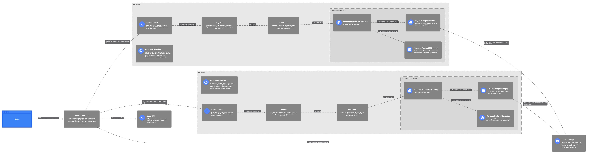

# Задание 1. Проектирование технологической архитектуры

Компания хочет сделать упор на развитие в регионах РФ. Планируется значительный рост количества пользователей и запросов. Нужно обеспечить бесперебойную работу сервиса 24/7, при этом сервис должен обслуживать клиентов из всех часовых поясов.

Требования к отказоустойчивости системы крайне высокие: RTO — 45 мин., RPO — 15 мин. Согласно требованиям бизнеса, доступность приложения должна быть равна 99,9%.

Дополнительно к этому нужно обеспечить одинаковое время загрузки страниц для пользователей из разных регионов. Оно не должно зависеть от географического местоположения пользователя.

На текущий момент сервис хранит ограниченный набор данных, который включает в себя:
* базовую информацию о клиентах — ФИО, контакты, документы,
* информацию о продуктах и тарифах,
* историю заявок клиентов.

Общий объём данных, которые хранятся в системе, равен 50 GB.

## Что нужно сделать

Необходимо спроектировать технологическую архитектуру приложения так, чтобы оно отвечало требованиям бизнеса. Создайте схему итогового решения на основании текущей технологической архитектуры сервиса.

Вот схема текущей архитектуры в draw.io:

Постарайтесь выдержать единый стиль оформления. Желательно, чтобы схема вашего решения была оформлена в той же нотации, что и схема текущей архитектуры. Для этого используйте библиотеки объектов Yandex Cloud. Ссылки на них мы дали в блоке «Как подготовиться к работе».

При проектировании уделите внимание следующим аспектам:

1. **Определите стратегию масштабирования и отказоустойчивости**. Рассмотрите вертикальное и горизонтальное масштабирование для вашей системы. Оцените, какая стратегия будет эффективнее. Требуется ли использование дополнительных зон безопасности?
2. Если приняли решение деплоить приложение в нескольких зонах безопасности, то продумайте и отразите на схеме следующие вопросы:
    a. **Проработайте конфигурацию развёртывания приложения в Kubernetes**. Вы будете использовать независимые кластеры в каждой площадке или один растянутый? Оставьте на схеме комментарий с объяснением, почему вы выбрали тот или другой подход.
    b. **Спланируйте балансировку нагрузки**. Опишите подход к балансировке нагрузки, который обеспечит распределение трафика между вашими сервисами и географически распредёленными серверами. Явно отразите на схеме все health check.
    c. **Определите наиболее подходящую фейловер-стратегию**. Она должна отвечать заданным требованиям отказоустойчивости. Отразите её на схеме на уровне взаимодействия клиента с приложением.
    d. **Определите конфигурацию базы данных**. Учитывая требования RTO и RPO, спроектируйте конфигурацию базы данных: определите, как вы будете обеспечивать репликацию данных и их резервное копирование. Если будете использовать конкретный фреймворк конфигурации кластера БД, отразите его на схеме.
3. Определите, будете ли вы применять шардирование БД. Отразите своё решение на схеме.

## Решение

