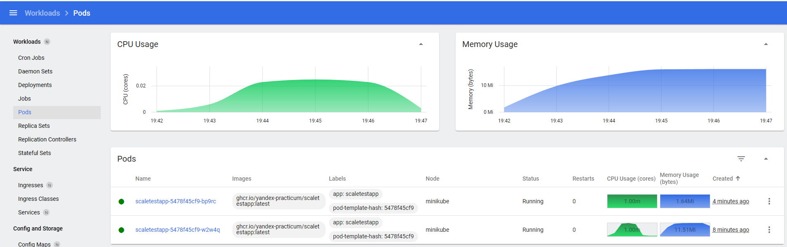
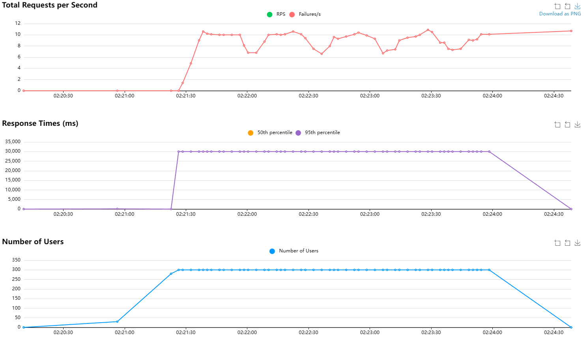
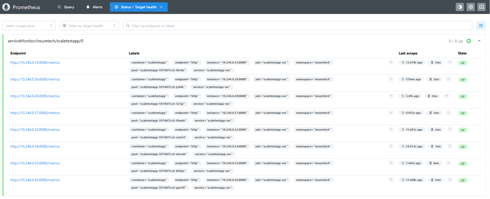

# Задание 2. Динамическое масштабирование контейнеров

Сейчас сервисы InsureTech развёрнуты в Kubernetes. Каждый из них развёрнут в определённом количестве экземпляров.

Обычно этих экземпляров достаточно для успешной обработки всех запросов. Но в периоды пиковой нагрузки система не справляется: она демонстрирует нестабильное поведение и постоянно перезагружает поды из-за нехватки памяти. Как следствие, пользователи получают негативный опыт работы с приложением. Бизнес видит, что NPS снижается.

Можно, конечно, держать больше реплик постоянно активными, чтобы система могла справиться с пиковыми нагрузками. Но это экономически невыгодно и приведёт к низким показателям утилизации ресурсов. Таким образом, вам необходимо решить проблему с помощью конфигурации динамического масштабирования для сервисов компании.

Вы будете тестировать динамическое масштабирование на примере простого приложения. Оно предоставляет два ресурса:
* `GET /` — получение идентификатора пода;
* `GET /metrics` — получение метрик в формате `Prometheus`.

Метрика `http_requests_total` возвращает количество запросов для метода получения идентификатора пода.

Образ тестового приложения. Оба метода приложения доступны по порту 8080.

## Часть 1. Динамическая маршрутизация на основании показателей утилизации памяти

1. Поднимите локальный кластер Kubernetes в Minikube.
2. Активируйте metrics-server.
3. Напишите манифест развёртывания (Deployment) Kubernetes для запуска тестового приложения. Для начального количества реплик установите значение, равное единице. Лимит памяти установите равный “30Mi”. Примените написанную конфигурацию в вашем кластере. В рамках пул-реквеста добавьте файл в директорию Task2.
4. Напишите и примените манифест сервиса (Service) для доступа к приложению, которое вы установили на прошлом шаге. В рамках пул-реквеста файл с этим манифестом тоже загрузите в директорию Task2.
5. Настройте динамическую маршрутизацию на основании показателей утилизации оперативной памяти с помощью Horizontal Pod Autoscaler (HPA). Для нашего тестового приложения оптимальный уровень утилизации памяти равен 80%. В качестве максимального количества реплик рекомендуем установить 10. Примените манифест в вашем кластере. В рамках пул-реквеста загрузите готовый манифест в директорию Task2.
    ```bash
    minikube service <имя сервиса> --url
    ```
6. Настройте динамическую маршрутизацию на основании показателей утилизации оперативной памяти с помощью Horizontal Pod Autoscaler (HPA). Для этого нужно активировать поддержку метрик в вашем кластере. Самый простой способ это сделать — воспользоваться командой:
    ```bash
    minikube addons enable metrics-server
    ```

7. Теперь создайте манифест для Horizontal Pod Autoscaler. Этот манифест будет автоматически масштабировать количество реплик вашего приложения в зависимости от роста потребления оперативной памяти (memory). Для нашего тестового приложения оптимальный уровень утилизации памяти равен 80%. В качестве максимального количества реплик рекомендуем установить 10. Примените манифест в вашем кластере. Загрузите готовый манифест в директорию Task2 в рамках пул-реквеста.
8. Теперь надо убедиться, что всё работает как задумано. Для этого необходимо сгенерировать нагрузку на приложение. Воспользуйтесь инструментом нагрузочного тестирования locust:

    a. Создайте Locustfile. Это сценарий на Python, где вы определяете поведение пользователей. Создайте файл с именем locustfile.py в удобной для вас директории. Скопируйте туда код:

    ```python
        from locust import HttpUser, between, task

        class WebsiteUser(HttpUser):
            wait_time = between(1, 5)

            @task
            def index(self):
                self.client.get("/")
    ```

    Этот пример создаёт класс пользователя, который переходит на главную страницу ("/") с интервалом между запросами от 1 до 5 секунд.

    b. Откройте терминал и перейдите в директорию, где находится ваш locustfile.py. Выполните команду:
    ```bash
    locust
    ```

    c. После запуска Locust откройте веб-браузер и введите адрес http://localhost:8089. Вы увидите веб-интерфейс Locust, где можно настроить параметры теста: количество пользователей и hatch rate — скорость, с которой генерируются новые пользователи.

    d. Запустите тест и проанализируйте результаты. Проще всего посмотреть результаты в дашборде Kubernetes. В локальном кластере Minikube его можно открыть с помощью команды:
    ```bash
    minikube dashboard
    ```

Сделайте скриншоты дашборда или выгрузите логи, которые покажут, что количество реплик поменялось в ответ на сгенерированную нагрузку.

### Решение

При тестировании использовались следующие параметры:

* **Number of users**: 300
* **Spawn rate**: 50
* **Time**: 3 minutes and 16 seconds

#### Kubernetes board:



#### Locust:


**Request Statistics**

| Type       | Name       | # Requests | # Fails | Average (ms) | Min (ms) | Max (ms) | Average size (bytes) | RPS   | Failures/s |
|------------|------------|------------|---------|--------------|----------|----------|----------------------|-------|------------|
| GET        | //         | 19036      | 0       | 57.44        | 6        | 232      | 67                   | 97.17 | 0          |
| Aggregated |            | 19036      | 0       | 57.44        | 6        | 232      | 67                   | 97.17 | 0          |

**Response Time Statistics**

| Method     | Name       | 50%ile (ms) | 60%ile (ms) | 70%ile (ms) | 80%ile (ms) | 90%ile (ms) | 95%ile (ms) | 99%ile (ms) | 100%ile (ms) |
|------------|------------|-------------|-------------|-------------|-------------|-------------|-------------|-------------|--------------|
| GET        | //         | 61          | 66          | 73          | 82          | 96          | 100         | 120         | 230          |
| Aggregated |            | 61          | 66          | 73          | 82          | 96          | 100         | 120         | 230          |


## Часть 2. Динамическая маршрутизация на основании показателей количества запросов в секунду

Kubernetes предоставляет возможность управлять масштабированием на основании CPU и memory. Однако на реальных проектах зачастую требуется бóльшая гибкость для управления масштабированием.

Для этого нужно использовать внешние метрики из системы мониторинга, которая может предоставить их в Kubernetes. Например, Prometheus.

В нашем проекте нужно настроить динамическое масштабирование на основании количества запросов в секунду (RPS) на один под приложения.

### Что нужно сделать

1. Установите Prometheus в вашем кластере.
2. Настройте экспорт метрик из приложения в Prometheus.
3. Проверьте, что метрики из вашего приложения поступают в Prometheus с помощью Prometheus Web UI: откройте раздел Graph или Targets и убедитесь, что метрики отображаются. Сделайте скриншоты интерфейса с метриками и загрузите их в директорию Task2.
4. Настройте автоматическое масштабирование по RPS через HPA. Для этого создайте новую версию манифеста. Когда будете сдавать задание, загрузите его в директорию Task2.
5. Теперь надо убедиться, что всё работает как задумано. Для этого сгенерируйте нагрузку на приложение. Действуйте по аналогии с шестым  шагом в обязательной части задания.

### Решение

При тестировании использовались следующие параметры:

* **Number of users**: 300
* **Spawn rate**: 50
* **Time**: 3 minutes and 5 seconds

#### Kubernetes board:


#### Locust:



**Request Statistics**

| Type       | Name | # Requests | # Fails | Average (ms) | Min (ms) | Max (ms) | Average size (bytes) | RPS  | Failures/s |
|------------|------|------------|---------|--------------|----------|----------|----------------------|------|------------|
| GET        | //   | 1442       | 1442    | 29900.17     | 49       | 30161    | 0                    | 7.81 | 7.81       |
| Aggregated |      | 1442       | 1442    | 29900.17     | 49       | 30161    | 0                    | 7.81 | 7.81       |

**Response Time Statistics**

| Method     | Name | 50%ile (ms) | 60%ile (ms) | 70%ile (ms) | 80%ile (ms) | 90%ile (ms) | 95%ile (ms) | 99%ile (ms) | 100%ile (ms) |
|------------|------|-------------|-------------|-------------|-------------|-------------|-------------|-------------|--------------|
| GET        | //   | 30000       | 30000       | 30000       | 30000       | 30000       | 30000       | 30000       | 30000        |
| Aggregated |      | 30000       | 30000       | 30000       | 30000       | 30000       | 30000       | 30000       | 30000        |

#### Prometheus:


