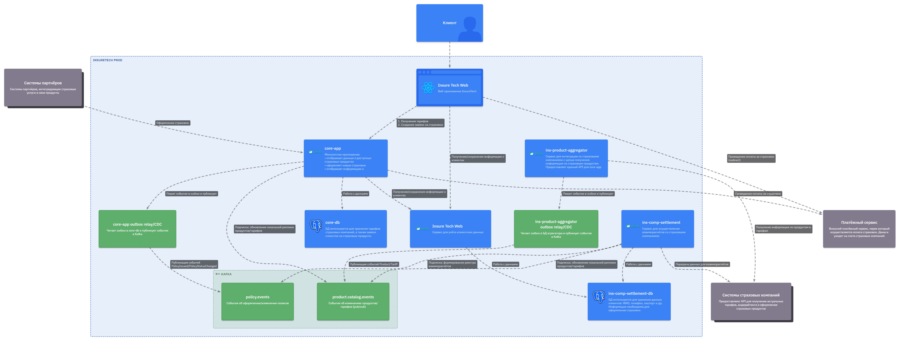

# Задание 3. Переход на Event-Driven архитектуру

Сервисы `core-app` и `ins-comp-settlement` получают данные о доступных продуктах через `REST API` сервиса `ins-product-aggregator`. В момент вызова он:
* запрашивает информацию из всех страховых компаний (сейчас их пять),
* агрегирует её в единый список,
* возвращает этот список в рамках того же синхронного запроса.

Чтобы ускорить работу сервисов, при изначальном проектировании команда решила хранить локальные реплики данных о продуктах и тарифах в сервисах `core-app` и `ins-comp-settlement`.

Сервис `core-app` осуществляет запрос к `ins-product-aggregator` раз в 15 минут, а `ins-comp-settlement` — раз в сутки (ночью), при формировании реестра оформленных страховок. Иногда команда сталкивается с ошибками взаимодействия между этими сервисами. Они связаны с задержками ответов или ошибками при взаимодействии с API страховых компаний.

Дополнительно сервис `ins-comp-settlement` раз в сутки осуществляет запрос в `core-app` по `REST API` для получения всех оформленных за день страховок. Эти данные он использует.
В ближайшее время InsureTech планирует подписать агентское соглашение ещё с пятью страховыми компаниями. Вам предстоит спроектировать решение, которое устранит текущие проблемы.

## Что нужно сделать

1. Проанализируйте текущую архитектуру. Создайте текстовый документ и напишите там список проблем и рисков, которые связаны с планируемым ростом нагрузки. Когда всё будет готово, загрузите документ в директорию Task3 в рамках пул-реквеста.
2. Обновите диаграмму контейнеров InsureTech, предложив решения для выявленных вами рисков и проблем. При этом:
    * Не меняя декомпозицию функциональности между сервисами, подумайте, какие взаимодействия стоит переделать на Event-Streaming.
    * Решите, будете ли вы использовать паттерн Transactional Outbox.

## Решение

**Заявки/предложения**: `ins-product-aggregator` публикует события в Kafka, `core-app` и `ins-comp-settlement` подписываются и обновляют локальные реплики.

**Оформленные страховки**: `core-app` публикует события “полис оформлен/изменён”, `ins-comp-settlement` подписывается, перестаёт делать nightly REST pull.

**Transactional Outbox**: Для `ins-product-aggregator` и `core-app` добавляем outbox (таблица в их БД) и “message relay/CDC”, чтобы избежать dual-write (БД+Kafka) и гарантировать: событие отправится если и только если транзакция в БД закоммитилась.
