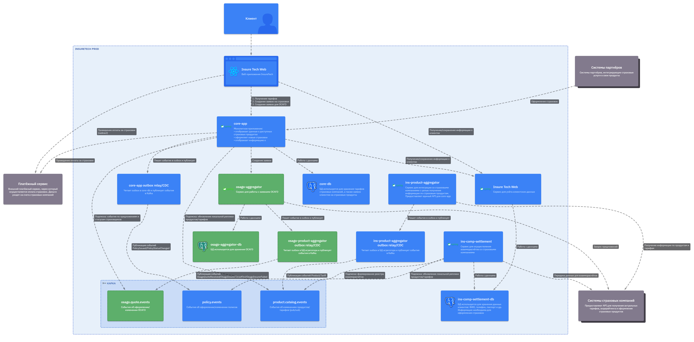

# Задание 4. Проектирование продажи ОСАГО

Компания планирует вскоре запустить новый продукт: оформление ОСАГО онлайн. Пользовательский путь выглядит так: клиенту предлагается заполнить заявку с информацией о своём автомобиле, после этого сервис запрашивает у всех доступных страховых компаний предложения с условиями страхования под заявку клиента. Бизнесу важно, чтобы на экране пользователя предложения от каждой страховой компании отображались сразу, как только от неё пришёл ответ. Максимальное время ожидания решения от страховой компании — 60 секунд.

Все страховые компании предоставляют однотипные REST API с двумя эндпоинтами:
* создать заявку на ОСАГО,
* получить предложение по заявке.

Бизнес предполагает, что в пик нагрузки количество одновременных пользователей, создающих заявку на ОСАГО, может достигать 2,5 тысячи человек.

Вы обсудили задачу с командой разработки и приняли такие решения:
1. Сохранить подход, который использовался для получения данных о продуктах и тарифах из страховых компаний.
2. Выделить отдельный сервис для взаимодействия со страховыми компаниями — `osago-aggregator`.

Функциональная обязанность этого сервиса — отправка заявок в страховые компании и дальнейший опрос решений по ним для передачи результатов в `core-app`. Остальная функциональность, связанная с оформлением ОСАГО, остаётся на стороне бэкенда в `core-app`.

Теперь вам нужно проработать ещё несколько моментов, исходя из требований бизнеса. Доработайте схему, которая у вас получилась в третьем задании. Отразите на ней ваши решения по этим вопросам:
1. Проработайте реализацию `osago-aggregator`. Решите:
2. Требуется ли ему своё хранилище данных?
3. Какой API он предоставляет `core-app`?
4. Определите средство интеграции между сервисами `core-app` и `osago-aggregator`.
5. Подумайте над API для веб-приложения в `core-app`.
6. Определите средство интеграции между веб-приложением и `core-app`. Если будете использовать средство, отличное от REST, отразите интеграцию новой стрелкой.
7. В зависимости от выбранных средств интеграции подумайте, требуется ли где-то применение паттернов отказоустойчивости:
   * Rate Limiting,
   * Circuit Breaker,
   * Retry,
   * Timeout.
8. Отобразите применение паттернов на схеме с помощью обозначений из этой библиотеки.

Примите во внимание, что сервисы задеплоены в нескольких экземплярах. Подумайте, зависит ли ваше решение от этого.

## Решение

У сервиса `osago-aggregator` будет своя БД, иначе невозможно корректно реализовать:

   * 60‑секундный “deadline” и состояние обработки по каждому страховщику,
   * устойчивый polling (перезапуск пода не должен терять прогресс),
   * дедупликацию/идемпотентность при ретраях,
   * контроль попыток/ошибок/таймаутов по каждому страховщику.

---

Интеграция `core-app` ↔ `osago-aggregator`

* **Команда (создать заявку)**: REST (HTTP) — `core-app` вызывает `osago-aggregator` синхронно только для постановки процесса, получает request_id и deadline_at.
* **Результаты (предложения/статусы)**: Event Streaming через Kafka — `osago-aggregator` публикует события `OsagoQuoteReceived/OsagoInsurerFailed/OsagoInsurerTimedOut` в топик, `core-app `подписывается. Это развязывает сервисы и не требует polling со стороны `core-app`.

---

API для веб‑приложения в `core-app`

* `POST /api/osago/requests` — создать заявку на ОСАГО (данные авто/водителей и т.п.), ответ: {request_id, deadline_at}.
* `GET /api/osago/requests/{request_id}` — получить текущий “срез” (кто ответил, какие предложения уже есть, кто в процессе/таймаут).
* `GET /api/osago/requests/{request_id}/stream` — стрим обновлений по мере поступления предложений (см. пункт 6).

---

Интеграция `web` ↔ `core-app`

* Для действий пользователя (создать заявку): `REST`.
* Для показа предложения сразу как пришло: `SSE`.

---

Где применять паттерны отказоустойчивости:

1. `web` → `core-app`

   * **Rate Limiting**: на входе (Ingress/API gateway), чтобы 2500 одновременных “заявок создать ОСАГО” не убили `core-app` и чтобы защититься от ботов/повторов.
   * **Timeout**: на `POST /api/osago/requests` небольшой (например, 2–5 секунд), потому что это только постановка процесса, не ожидание оффера.

2. `core-app` → `osago-aggregator`

   * **Timeout**: короткий (чтобы не блокировать UX).
   * **Retry**: очень аккуратно и только при transient ошибках; лучше с идемпотентностью (Idempotency-Key / request_id).
   * **Circuit Breaker**: когда `osago-aggregator` начинает часто отвечать ошибками или сильно тормозить, circuit breaker в `core-app` временно прекращает попытки ходить в него.

3. `osago-aggregator` → страховые компании

   * **Timeout**: обязательно (верхняя граница задержки; иначе повисшие вызовы выедят пул потоков/соединений). Timeout ограничивает latency.
   * **Retry**: только с backoff, ограниченно, только для transient (сетевые, 429/503), иначе ретраи усиливают нагрузку.
   * **Circuit Breaker**: per-insurer, чтобы один проблемный страховщик не “съел” ресурсы агрегатора и не испортил ответы по остальным.
   * **Rate Limiting**: per-insurer, чтобы не превысить лимиты внешнего API и не получить бан/массовые 429.

---

**Transactional Outbox**

Рекомендуется использовать outbox в для событий, чтобы не было ситуации: `в БД заявку записали, а в Kafka не отправили` или наоборот. Transactional outbox решает проблему надёжной публикации событий при распределённом взаимодействии.
